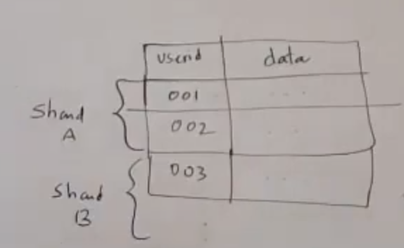
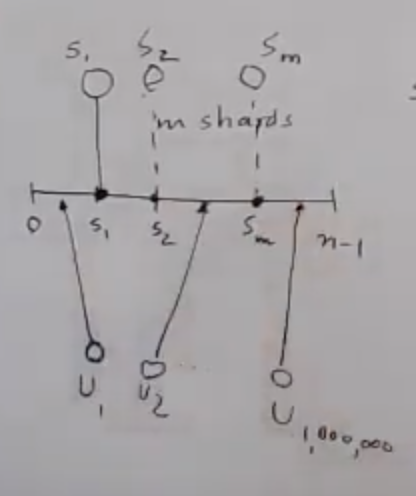
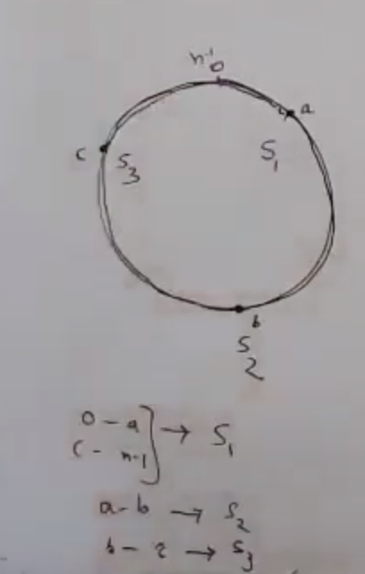
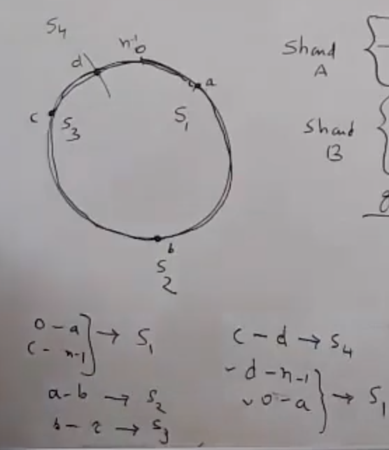

# Database sharding
- Partitioning of data horizontally
- Goal is to get near even distributions
- For 1 millions rows in a table with 100 shards; we are looking for on average 10,000 rows per shard for that table
- You should be able to add new shards very easily
- Keep track of shard is not available/down

# Shard Design
## Fixed n number of shards
shard = userId % n
Problem: 
- On adding new shard; all existing calculations will go on toss
- Adding new shard is very expensive
- It might bring entire system down until data is migrated
## Consistent hashing
### Shard data
- Choose a number range from 0 to n-1. Here n is not necessarily equal to shards
- Let's say we have m shards starting from S1, S2 ....to Sm
- Let's say we have users starting from U1, U2, .... to U1million
- Divide both shards and users on same fixed number range from 0 to n-1

S1 >> 1 % (n-1) = 1
S2 >> 2 % (n-1) = 1
.
.
.
Sm >> m % (n-1) = m

U1 >> 1 % (n-1) = 1
U2 >> 2 % (n-1) = 2
.
.
.
U1000,000 >> 1000,000 % (n-1) = x

Following will be approach to divide data
- Everything from 0 to S1 will be served by S1
- Everything from 1 to S2 will be served by S2
- Everything from Sm to n-1 will be served by S1
- This makes a circle

Following is circular representation of consitent hashing for 3 shards

### On adding new shard
On adding new shard s4
- c to d >> s4
- d to 0 and 0 to a >> s1
- We just need to initialize data between c and d on s4
- Remove c to d data from S1
- Don't have to touch any other part of data

### On removing existing shard
